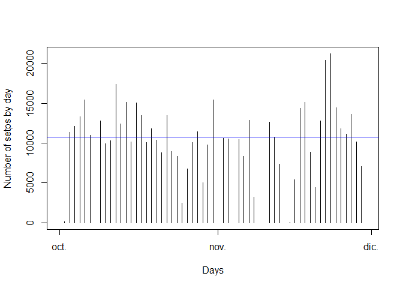
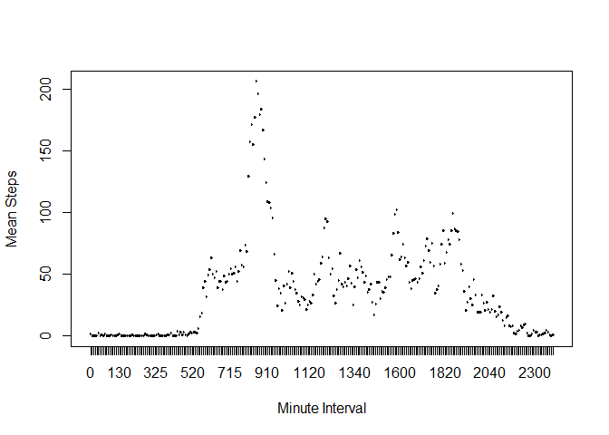
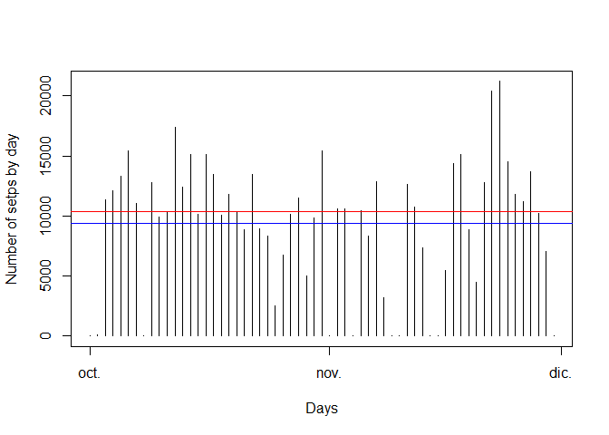
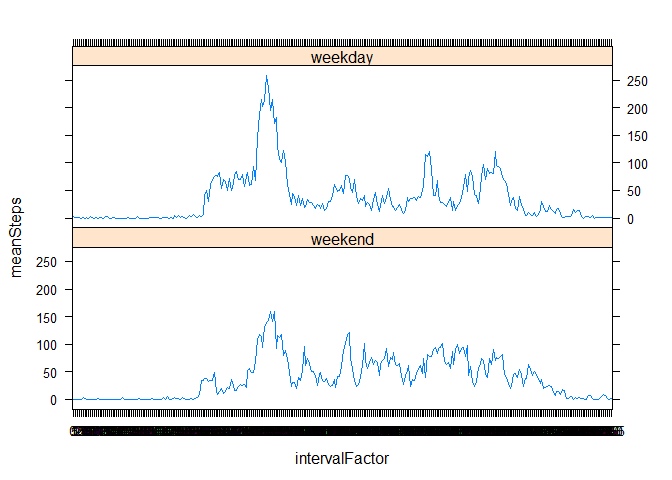

# Reproducible Research: Peer Assessment 1


## Loading and preprocessing the data
For this activity we have to follow 3 steps:

1. Read the data. We are assuming that the dataset is in a file named "activity.csv" on the Working directory.

2. Transform the data to create a new dataset with the totals by day

3. Transform the data to create a new dataset with the totals by interval


```r
library(dplyr)
```

```
## 
## Attaching package: 'dplyr'
## 
## The following object is masked from 'package:stats':
## 
##     filter
## 
## The following objects are masked from 'package:base':
## 
##     intersect, setdiff, setequal, union
```

```r
## Load the data
data <- read.csv("activity.csv")

## Process/transform the data into a format suitable for your analysis
## Dataset by day (Calculate the total number of steps taken per day)
aux1 <- group_by(data, date)
dataByDay <- summarize(aux1, total=sum(steps))
dataByDay$date <- strptime(dataByDay$date, "%Y-%m-%d")

##Dataset by interval
data$intervalFactor <- factor(data$interval)
aux2 <- group_by(data, intervalFactor)
dataByInterval <- summarize(aux2, total=sum(steps), meanSteps=mean(steps, na.rm=TRUE))
```

## What is mean total number of steps taken per day?
We are goint to use the "dataByDay" dataset to create an histogram graphic with the total
number of steps taken each day.

Then we are going to calculate the **mean** and the **median** taken per day


```r
meanSteps = mean(dataByDay$total, na.rm=TRUE)
medianSteps = median(dataByDay$total, na.rm=TRUE)
```

mean: 1.0766189\times 10^{4}  
median: 10765  


```r
## Make a histogram of the total number of steps taken each day
plot(dataByDay$date, dataByDay$total, 
     type="h", ylab="Number of setps by day", 
     xlab="Days")

## Calculate and report the mean and median of the total number of steps taken per day
abline(h=medianSteps, col="red")
abline(h=meanSteps, col="blue")
```

 

## What is the average daily activity pattern?
For this, we need to 

* Know the average of steps for each 5-minute interval

* Know wich 5-minute interval on average, contains teh maximum number of steps


```r
## Which 5-minute interval, on average across all the days in the dataset,
## contains the maximum number of steps?
maxSteps <- max(dataByInterval$meanSteps)
maxInterval <- dataByInterval[dataByInterval$meanSteps==maxSteps,]$intervalFactor

## Make a time series plot of the 5-minute interval
## and the average number of steps taken, averaged across all days
plot(dataByInterval$intervalFactor, dataByInterval$meanSteps, 
     type="l", ylab="Mean Steps", 
     xlab="Minute Interval")
```

 

Max Average Steps: 206.1698113  
Max Interval: 835  

## Imputing missing values

First we are going to calculate the total number of missing values in the dataset

```r
totalNA = length(data$steps[is.na(data$steps)])
```

Total NA values: 2304

Next, we have to devise a strategy for filling in all of the missing values in the dataset,
and the, create a new dataset that is equal to the original dataset
but with the missing data filled in.
In this case we are going to just asign a zero value


```r
dataNoNA <- data
dataNoNA[is.na(dataNoNA$steps),]$steps <- 0
```

Now we're going to make a histogram of the total number of steps taken each day and calculate
the mean and median total number of steps taken per day


```r
aux1 <- group_by(dataNoNA, date)
dataByDayNoNA <- summarize(aux1, total=sum(steps))
dataByDayNoNA$date <- strptime(dataByDayNoNA$date, "%Y-%m-%d")

meanStepsNoNA = mean(dataByDayNoNA$total, na.rm=TRUE)
medianStepsNoNA = median(dataByDayNoNA$total, na.rm=TRUE)
```

mean: 9354.2295082  
median: 1.0395\times 10^{4}  


```r
## Make a histogram of the total number of steps taken each day
plot(dataByDayNoNA$date, dataByDayNoNA$total, 
     type="h", ylab="Number of setps by day", 
     xlab="Days")

## Calculate and report the mean and median of the total number of steps taken per day
abline(h=medianStepsNoNA, col="red")
abline(h=meanStepsNoNA, col="blue")
```

 

### Do these values differ from the estimates from the first part of the assignment?
Yes... specially ont he mean and median. The general shape of the graphic is the same.

### What is the impact of imputing missing data on the estimates of the total daily number of steps?
In this case, probably zeroing the values is not the best choice.


## Are there differences in activity patterns between weekdays and weekends?

First, we have to create the new factor.
**Note**: Please, be advised that my computer is in spanish!!!


```r
weekdays1 <- c('lunes', 'mates', 'miércoles', 'jueves', 'viernes')
data$weekDays <- factor((weekdays(strptime(data$date, "%Y-%m-%d")) %in% weekdays1)+1L, levels=1:2, labels=c('weekend', 'weekday'))
aux3 <- group_by(data, intervalFactor, weekDays)
aux4 <- summarize(aux3, total=sum(steps), meanSteps=mean(steps, na.rm=TRUE))
library(lattice)
xyplot(meanSteps ~ intervalFactor | weekDays, data=aux4, layout=c(1,2), type="l")
```

 

The peak of steps is during the weekday.


